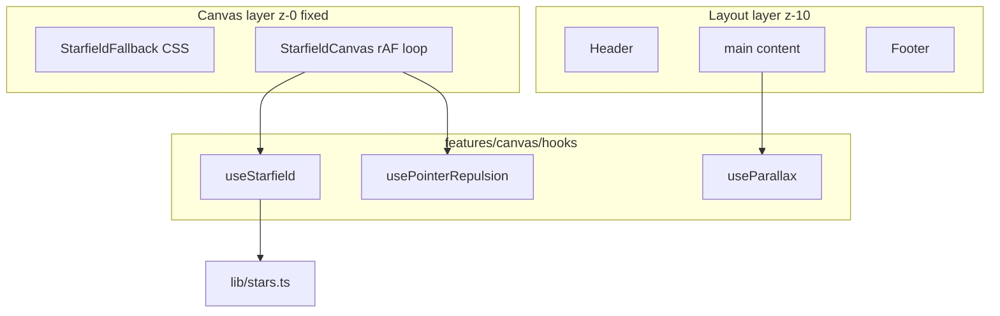

# Phase 2 — 2D Interactivity Plan

## Goals

Deliver a **full-page fixed starfield** behind the layout, with **scroll parallax**, **mouse-driven star repulsion/glow**, and a **static CSS fallback** when `prefers-reduced-motion: reduce`. Stay within [ADR 0003](docs/decisions/0003-hybrid-visuals.md): all 2D/WebGL-adjacent logic in j`src/features/canvas/`, never inside shadcn or `shared/ui`.

## Current baseline (Phase 1)

- Single route: `[src/features/home/HomePage.tsx](src/features/home/HomePage.tsx)` renders `Layout` + `[Hero](src/features/hero/Hero.tsx)`.
- Hero uses a static CSS nebula gradient (`absolute` div in `Hero.tsx`).
- Tokens in `[src/styles/tokens.css](src/styles/tokens.css)`; motion hook exists only as `--motion-duration` under reduced-motion.
- No `src/features/canvas/` yet; [add-2d-effect skill](.cursor/skills/add-2d-effect/SKILL.md) is a stub.

## Architecture




| Layer                                  | z-index | Role                                                   |
| -------------------------------------- | ------- | ------------------------------------------------------ |
| `StarfieldBackground` (fixed, inset-0) | 0       | Canvas or fallback; `pointer-events-none` on container |
| `Layout` / hero content                | 10+     | Readable text; hero keeps `relative` stacking          |


**Integration point:** Mount background in `[src/features/shell/Layout.tsx](src/features/shell/Layout.tsx)` (wraps all pages), not inside `Hero`, so the starfield persists across future sections without cross-feature imports from `hero` → `canvas`.

```tsx
// Layout.tsx (conceptual)
<div className="relative min-h-screen">
  <StarfieldBackground />
  <div className="relative z-10 flex min-h-screen flex-col">
    <Header /> ...
  </div>
</div>
```

## Module structure (new)

```
src/features/canvas/
├── AGENTS.MD
├── index.ts                    # public: StarfieldBackground, hooks if needed externally
├── StarfieldBackground.tsx     # reduced-motion branch + lazy canvas
├── StarfieldCanvas.tsx         # <canvas> + rAF lifecycle
├── StarfieldFallback.tsx       # static nebula + CSS star specks (no rAF)
├── hooks/
│   ├── useStarfield.ts         # init particles, resize, visibility pause
│   ├── useParallax.ts          # scroll + optional hero content offset
│   └── usePointerRepulsion.ts  # normalized pointer, repulsion radius
└── lib/
    ├── stars.ts                # create/update/draw particles
    └── constants.ts            # density, speeds, mobile caps
```

**Lazy load:** `React.lazy(() => import('./StarfieldCanvas'))` inside `StarfieldBackground`, with `StarfieldFallback` as `Suspense` fallback and permanent reduced-motion path. Keeps canvas logic out of initial chunk where possible ([NFR-1](docs/requirements.md)).

## Feature behavior

### 1. Starfield (`StarfieldCanvas` + `lib/stars.ts`)

- Fixed full-viewport canvas sized via `ResizeObserver` + `devicePixelRatio` capped (e.g. `min(dpr, 2)` on desktop, `1.5` on mobile).
- Particle pool: ~120–200 stars desktop, ~60–80 mobile (`matchMedia('(max-width: 768px)')`).
- Each star: `x`, `y`, `z` (depth), `radius`, `opacity`; draw with `color-mix` / token-derived RGB from CSS vars read once on mount (`getComputedStyle` on `document.documentElement` for `--color-star`, `--color-accent`, `--color-orbit`).
- **Repulsion:** on pointer move, stars within radius `R` get velocity away from cursor; damped return to drift. Subtle **glow** near cursor (radial gradient overlay on canvas or brighter star alpha).
- **Drift:** slow autonomous motion when pointer idle.
- **Pause:** stop `requestAnimationFrame` when `document.hidden` or reduced-motion (guard in hook).

### 2. Parallax (`useParallax`)

- **Scroll:** pass `scrollY` into starfield depth scaling (farther stars move slower) in `lib/stars.ts` update step.
- **Hero content:** apply subtle `transform: translate3d(...)` on hero inner wrapper via hook (max ~8–12px) from scroll progress and/or pointer—keep motion small for [NFR-2](docs/requirements.md).
- Remove duplicate static gradient from `[Hero.tsx](src/features/hero/Hero.tsx)` (canvas/fallback provides atmosphere); keep hero text/CTAs unchanged.

### 3. Reduced motion (`StarfieldFallback`)

- If `window.matchMedia('(prefers-reduced-motion: reduce)')` matches → render only `StarfieldFallback` (no canvas, no rAF).
- Fallback: layered CSS gradients using existing tokens (reuse current hero gradient recipe moved from `Hero.tsx`).
- Listen for `change` on media query to toggle if user changes OS setting at runtime.

### 4. Pointer events

- Canvas container: `pointer-events-none` so links/buttons stay clickable.
- Repulsion uses `window` `pointermove` / `pointerleave` (passive listeners) with coordinates relative to viewport—no hit-testing on canvas.

## Optional (stretch, not blocking)

- shadcn `tooltip` on 2–3 fixed “constellation” hotspots in hero (roadmap optional). Defer unless time permits; document in roadmap as Phase 2b.

## Content / config

- **No `portfolio.json` changes required** for Phase 2 (visual constants in `lib/constants.ts`). Optional later: `canvas: { density, repulsionRadius }` in schema—out of scope unless you want tunable demos.

## Documentation and agent harness


| Artifact                                                                               | Action                                                |
| -------------------------------------------------------------------------------------- | ----------------------------------------------------- |
| [docs/roadmap.md](docs/roadmap.md)                                                     | Mark Phase 2 tasks + acceptance criteria              |
| [docs/requirements.md](docs/requirements.md)                                           | Add FR-6 (animated starfield), NFR canvas performance |
| [docs/decisions/0006-canvas-performance.md](docs/decisions/0006-canvas-performance.md) | **New ADR**: particle caps, DPR cap, pause rules      |
| [docs/patterns.md](docs/patterns.md)                                                   | § Canvas: import only from `@/features/canvas`        |
| [src/features/canvas/AGENTS.MD](src/features/canvas/AGENTS.MD)                         | New module guide                                      |
| [src/features/AGENTS.MD](src/features/AGENTS.MD)                                       | Link `canvas/` module                                 |
| [src/features/shell/AGENTS.MD](src/features/shell/AGENTS.MD)                           | Note `StarfieldBackground` wiring                     |
| [.cursor/skills/add-2d-effect/SKILL.md](.cursor/skills/add-2d-effect/SKILL.md)         | Replace stub with full checklist                      |
| [AGENTS.MD](AGENTS.MD)                                                                 | Phase 2 module in map                                 |


No new Cursor rules required if canvas boundaries stay in `feature-modules.mdc` + ADR 0003/0006.

## Performance and a11y acceptance

- Lighthouse: no major CLS from canvas mount; fixed positioning prevents layout shift.
- Main thread: target 60fps on mid desktop; degrade particle count on mobile.
- **Never** block first contentful paint: `StarfieldFallback` visible immediately; canvas hydrates after lazy load.
- Decorative canvas: `aria-hidden="true"` on canvas; no focusable elements in canvas layer.
- Verify with `prefers-reduced-motion` emulation in DevTools.

## Testing / verification

```bash
npm run typecheck
npm run lint
npm run build
npm run dev
```

Manual checks:

1. Full-page stars visible behind header/hero/footer.
2. Mouse move repels nearby stars; glow visible near cursor.
3. Scroll adjusts parallax (stars + subtle hero shift).
4. Reduced motion → static fallback only, no console errors.
5. Tab backgrounded → animation pauses (CPU drops).

## Out of scope (Phase 2)

- Phase 3 sections (about, projects, etc.).
- R3F / Three.js ([Phase 4](docs/roadmap.md)).
- shadcn sheet/dialog (Phase 3).
- Scroll-triggered section reveals for below-fold sections (can seed `useParallax` for Phase 3 reuse, but no new sections yet).

## Implementation order

1. Scaffold `features/canvas` + `lib/stars.ts` + constants.
2. `StarfieldFallback` + `useStarfield` + `StarfieldCanvas` (draw only, no repulsion).
3. `usePointerRepulsion` + glow.
4. `useParallax` (scroll + hero transform).
5. `StarfieldBackground` with reduced-motion + lazy `Suspense`.
6. Wire into `Layout.tsx`; simplify `Hero.tsx` gradient.
7. Docs, ADR 0006, AGENTS.MD, skill update.
8. QA pass + fix lint/types.

## Phase 2 done when

- Full-page starfield runs in dev/prod build with repulsion + parallax.
- Reduced-motion shows static fallback; no Base UI / canvas console errors.
- Canvas isolated under `src/features/canvas/`; `Layout` owns mount point.
- Docs and agent files updated; `npm run build` passes.

