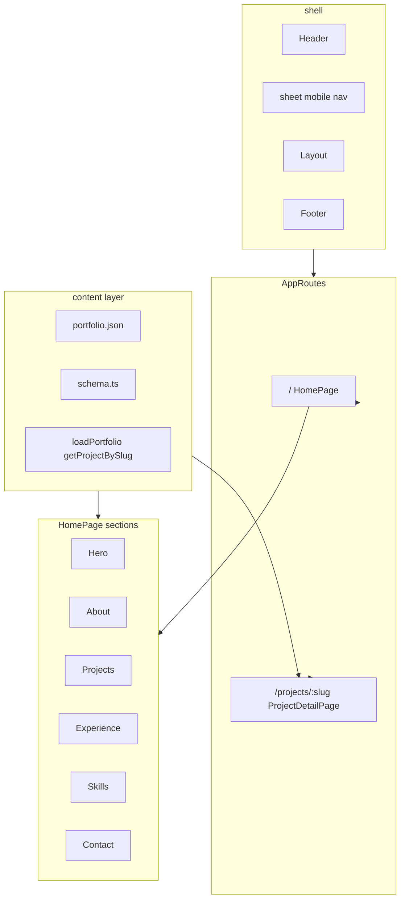

# Phase 3 — Portfolio Sections Plan

## Goals

Turn the single-hero page into a **full single-page portfolio** with anchor sections, add `**/projects/:slug` detail pages**, ship **mobile navigation**, and use **shadcn selectively** per [ADR 0005](docs/decisions/0005-shadcn-selective.md). Content stays driven by `[portfolio.json](src/content/portfolio.json)` + Zod.

## Your scope choices

- **Contact**: validated form → `**mailto:`** (no backend)
- **Projects**: **grid on home** + `**/projects/:slug`** detail routes

---

## Current baseline

- `[HomePage.tsx](src/features/home/HomePage.tsx)` renders only `Hero`
- `[routes.tsx](src/app/routes.tsx)`: single route `/`
- Content schemas for all sections **already exist** in `[schema.ts](src/content/schema.ts)`; JSON has placeholder data
- Nav anchors `#about`, `#projects`, `#contact` — **missing** `#experience`, `#skills`
- Header: desktop nav only (`hidden md:flex`); **no mobile menu**
- shadcn: **button** only

---

## Architecture




**Composition rule**: `[HomePage](src/features/home/HomePage.tsx)` stacks section features; no cross-feature imports. Project detail is a **separate route page** under `features/projects/`.

---

## Content schema extension

Extend `[projectSchema](src/content/schema.ts)` for detail pages:

```ts
body: z.array(z.string()).min(1)  // long-form paragraphs for /projects/:slug
```

Add to each project in `[portfolio.json](src/content/portfolio.json)` + document in `[docs/content-schema.md](docs/content-schema.md)`.

Add helpers in `[src/content/index.ts](src/content/index.ts)`:

- `getProjectBySlug(slug: string): Project | undefined`
- `getAllProjectSlugs(): string[]` (for 404 handling / future static paths)

Update `[portfolio.json](src/content/portfolio.json)` nav:

```json
{ "label": "Experience", "href": "#experience" },
{ "label": "Skills", "href": "#skills" }
```

---

## shadcn components (Phase 3 allowlist)

Run via `add-shadcn-component` skill; verify files land in `src/components/ui/`:


| Component                    | Use                                                                                               |
| ---------------------------- | ------------------------------------------------------------------------------------------------- |
| `badge`                      | Tech tags on `[ProjectCard](src/features/projects/ProjectCard.tsx)`                               |
| `separator`                  | Between experience items / section dividers                                                       |
| `tabs`                       | Project filter (All / Featured) in `[ProjectsSection](src/features/projects/ProjectsSection.tsx)` |
| `sheet`                      | Mobile nav in `[Header](src/features/shell/Header.tsx)`                                           |
| `input`, `label`, `textarea` | Contact form in `[ContactSection](src/features/contact/ContactSection.tsx)`                       |


**Not in Phase 3**: `dialog` for project quick-view (detail route replaces it).

---

## Feature modules to create

```
src/features/
├── about/
│   ├── AGENTS.MD
│   ├── AboutSection.tsx
│   └── index.ts
├── projects/
│   ├── AGENTS.MD
│   ├── ProjectsSection.tsx      # grid + tabs filter
│   ├── ProjectCard.tsx          # bespoke cosmic card + badge
│   ├── ProjectDetailPage.tsx    # route target
│   ├── ProjectDetail.tsx        # detail layout
│   └── index.ts
├── experience/
│   ├── AGENTS.MD
│   ├── ExperienceSection.tsx    # timeline-style list + separator
│   └── index.ts
├── skills/
│   ├── AGENTS.MD
│   ├── SkillsSection.tsx        # category groups
│   └── index.ts
└── contact/
    ├── AGENTS.MD
    ├── ContactSection.tsx       # form → mailto
    └── index.ts
```

### Section design notes (space theme, bespoke layout)

- Reuse `[Container](src/shared/ui/Container.tsx)` + `[Section](src/shared/ui/Section.tsx)`
- Optional shared `[SectionHeading](src/shared/ui/SectionHeading.tsx)` (title + optional subtitle from content) — marketing UI, not shadcn Card
- **About**: title + body paragraphs from content
- **Projects**: responsive grid; tabs filter `featured` vs all; card links to `/projects/:slug`; external `href`/`repo` as secondary links on detail page
- **Experience**: vertical timeline with `separator`; role/company/period/description from content
- **Skills**: category headings + badge-like chips (shadcn `badge` or bespoke pills — prefer badge per ADR)
- **Contact**: intro copy + form (name, email, message); client Zod validate → `mailto:${contact.email}?subject=...&body=...`

### Project detail route

`[src/app/routes.tsx](src/app/routes.tsx)`:

```tsx
<Route path="/" element={<HomePage />} />
<Route path="/projects/:slug" element={<ProjectDetailPage />} />
```

- `ProjectDetailPage`: `Layout` + `ProjectDetail`; 404-style message if slug not found (link back home)
- Lazy-load optional: `React.lazy(() => import('@/features/projects/ProjectDetailPage'))` to keep home bundle lean
- Detail page: title, summary, tech badges, body paragraphs, CTA links (live demo / repo)

---

## Shell updates

### Mobile navigation (`[Header.tsx](src/features/shell/Header.tsx)`)

- Hamburger visible `md:hidden`; desktop nav unchanged
- shadcn `Sheet`: nav links from `loadPortfolio().nav` + CTA
- Close sheet on link click (anchor or route)

### Smooth scroll

Add `scroll-behavior: smooth` on `html` in `[globals.css](src/styles/globals.css)` with `@media (prefers-reduced-motion: reduce) { scroll-behavior: auto }` per [ADR 0007](docs/decisions/0007-canvas-interaction-ux.md) a11y pattern.

---

## Shared UI (minimal)

Add to `[src/shared/ui/](src/shared/ui/)`:

- `SectionHeading.tsx` — consistent section titles (uses tokens, not shadcn)

---

## Agentic documentation


| Artifact                                                                                               | Action                                                                 |
| ------------------------------------------------------------------------------------------------------ | ---------------------------------------------------------------------- |
| [docs/decisions/0008-portfolio-sections-routing.md](docs/decisions/0008-portfolio-sections-routing.md) | **New ADR**: SPA sections, detail routes, mailto contact, shadcn usage |
| [docs/roadmap.md](docs/roadmap.md)                                                                     | Mark Phase 3 in progress / complete criteria                           |
| [docs/requirements.md](docs/requirements.md)                                                           | FR for sections, project routes, contact                               |
| [docs/patterns.md](docs/patterns.md)                                                                   | Section composition, project routing, mailto pattern                   |
| [docs/content-schema.md](docs/content-schema.md)                                                       | `project.body`, nav updates                                            |
| Per-feature `AGENTS.MD`                                                                                | Each new feature folder                                                |
| [src/features/AGENTS.MD](src/features/AGENTS.MD)                                                       | Link new modules                                                       |
| [src/features/shell/AGENTS.MD](src/features/shell/AGENTS.MD)                                           | Mobile sheet nav                                                       |
| [AGENTS.MD](AGENTS.MD)                                                                                 | Module map + ADR 0008                                                  |


---

## Testing (Playwright)

Extend `[e2e/home.spec.ts](e2e/home.spec.ts)` and add `[e2e/projects.spec.ts](e2e/projects.spec.ts)`:

- Home: all section headings visible (`#about`, `#projects`, `#experience`, `#skills`, `#contact`)
- Projects: tab filter switches visible cards
- Navigate to `/projects/orbital-telemetry` — detail title + body
- Invalid slug — not-found UI
- Contact: fill form, submit triggers `mailto:` navigation (intercept `page.goto` or check `href` assignment)
- Mobile viewport: sheet opens, nav link works

---

## Phase 3 acceptance criteria

- `npm run dev` — scrollable home with 6 sections + working anchor nav
- `/projects/:slug` works for all slugs in JSON; graceful unknown slug
- Mobile sheet nav on small viewports
- Contact form validates and opens mailto (no API)
- shadcn allowlist components added; cosmic look preserved (no Card-as-hero)
- 
- `npm run typecheck`, `lint`, `build`, `test:e2e` pass
- ADR 0008 + AGENTS/docs updated

---

## Out of scope (Phase 3)

- Contact backend / Formspree / email API
- Project quick-view Dialog (using detail route instead)
- Phase 4 R3F 3D
- SEO meta / OG (Phase 5)
- Scroll-triggered reveal animations (optional stretch)

---

## Implementation order

1. Extend content schema + JSON + loaders + nav
2. Add shadcn components (badge, separator, tabs, sheet, input, label, textarea)
3. Shared `SectionHeading`
4. Features: about → experience → skills (simple sections first)
5. Projects: ProjectCard, ProjectsSection with tabs, detail page + route
6. Contact: mailto form
7. Header mobile sheet + smooth scroll
8. Wire `HomePage` composition
9. Docs ADR 0008 + AGENTS updates
10. Playwright expansion + verify

