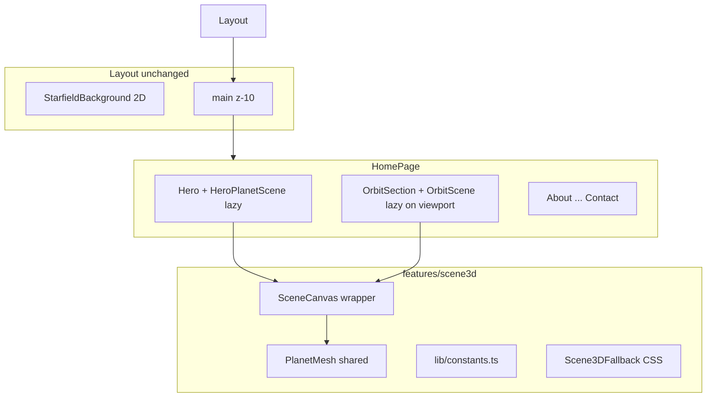

# Phase 4 — Hybrid 3D Plan

## Scope (confirmed)

| Choice | Decision |
|--------|----------|
| Mount points | **Hero accent** + **dedicated `#orbit` section** |
| Interaction | **Decorative** — slow auto-rotate, `pointer-events-none`, no OrbitControls |
| 2D canvas | **Keep** existing [`StarfieldBackground`](src/features/canvas/StarfieldBackground.tsx) in [`Layout`](src/features/shell/Layout.tsx) — 3D does not replace starfield |

## Architecture



**Composition rules** (extend [ADR 0003](docs/decisions/0003-hybrid-visuals.md)):

- All WebGL lives under `src/features/scene3d/` — never in shadcn or `shared/ui`
- Hero imports `HeroPlanetScene` from `@/features/scene3d` (same exception pattern as shell → canvas)
- Orbit section is its own feature folder `features/orbit/` wrapping scene3d (keeps hero thin)
- Two Canvas instances allowed; **orbit Canvas mounts only when section enters viewport** (IntersectionObserver) to avoid dual rAF on initial load

## Dependencies

Install (document exact versions in new ADR):

```bash
npm install three @react-three/fiber @react-three/drei
npm install -D @types/three
```

Optional Vite chunk split in [`vite.config.ts`](vite.config.ts):

```ts
build: { rollupOptions: { output: { manualChunks: { three: ['three'] } } } }
```

## Module layout

```
src/features/scene3d/
├── AGENTS.MD
├── index.ts
├── SceneCanvas.tsx          # R3F Canvas: DPR cap, gl alpha, Suspense inner
├── PlanetMesh.tsx             # Shared icosahedron/sphere + emissive material, useFrame rotate
├── HeroPlanetScene.tsx        # Small camera FOV, lazy export
├── OrbitPlanetScene.tsx       # Large variant, lazy export
├── Scene3DFallback.tsx        # CSS gradient orb (matches tokens)
├── hooks/
│   ├── usePrefersReducedMotion.ts
│   └── useInViewport.ts       # IntersectionObserver for orbit lazy mount
└── lib/
    ├── constants.ts             # ROTATION_SPEED, DPR caps, mesh scale per variant
    └── colors.ts                # Read --color-accent / --color-orbit from CSS

src/features/orbit/
├── AGENTS.MD
├── OrbitSection.tsx           # Section + Container + optional heading from content
└── index.ts
```

## Content (minimal)

Extend [`schema.ts`](src/content/schema.ts) + [`portfolio.json`](src/content/portfolio.json):

```ts
orbitContentSchema = z.object({
  title: z.string(),
  subtitle: z.string().optional(),
})
```

Example JSON:

```json
"orbit": {
  "title": "In orbit",
  "subtitle": "Exploration starts where comfort ends."
}
```

Add nav item `{ "label": "Orbit", "href": "#orbit" }` after Home or Projects (your choice during implementation).

## UI design

### Hero accent ([`Hero.tsx`](src/features/hero/Hero.tsx))

- Grid/flex: copy left, 3D right on `md+`; stacked on mobile (scene below CTAs or absolute behind text with low opacity — prefer **below CTAs** for readability)
- Wrapper: `pointer-events-none absolute md:relative`, fixed height (`h-48 md:h-64 lg:h-80`), `aria-hidden`
- Reduced motion → no Canvas; starfield shows through

### Orbit section (`#orbit`)

- Full-width band: `min-h-[50vh] md:min-h-[60vh]`, scene centered
- Optional [`SectionHeading`](src/shared/ui/SectionHeading.tsx) above scene from content
- Canvas fills section; decorative only
- Mount WebGL only when `useInViewport` is true; show `Scene3DFallback` until then and when reduced-motion

### Shared planet look

- Low-poly icosahedron or sphere with `MeshStandardMaterial` / emissive accent from tokens
- Slow Y-axis rotation in `useFrame` (pause when `document.hidden`, mirror [ADR 0006](docs/decisions/0006-canvas-performance.md))
- Subtle ambient + point light; no shadows (perf)
- Transparent WebGL (`alpha: true`) so 2D starfield remains visible behind

## Performance budget (new ADR 0010)

| Rule | Value |
|------|-------|
| DPR desktop | `min(dpr, 2)` |
| DPR mobile (`max-width: 768px`) | `min(dpr, 1.5)` |
| Hero Canvas | Always lazy chunk; mounts after hero paint |
| Orbit Canvas | Viewport-gated + lazy chunk |
| Reduced motion | CSS fallback only, no WebGL |
| Tab hidden | Pause `useFrame` rotation |
| Draw calls | Single mesh + lights; no postprocessing in Phase 4 |

## Integration points

| File | Change |
|------|--------|
| [`HomePage.tsx`](src/features/home/HomePage.tsx) | Insert `<OrbitSection />` after `<Hero />` |
| [`Hero.tsx`](src/features/hero/Hero.tsx) | Mount `HeroPlanetScene` in decorative wrapper |
| [`portfolio.json`](src/content/portfolio.json) | `orbit` content + nav link |
| [`schema.ts`](src/content/schema.ts) | `orbitContentSchema` on portfolio |
| [`vite.config.ts`](vite.config.ts) | Optional `manualChunks.three` |

**Do not** add 3D to [`Layout.tsx`](src/features/shell/Layout.tsx) — keeps 3D opt-in per section per ADR 0003.

## Agentic documentation

| Artifact | Action |
|----------|--------|
| [docs/decisions/0010-scene3d-performance.md](docs/decisions/0010-scene3d-performance.md) | **New ADR**: R3F stack, dual mount strategy, perf caps, reduced-motion |
| [docs/roadmap.md](docs/roadmap.md) | Mark Phase 4 in progress / done criteria |
| [docs/requirements.md](docs/requirements.md) | FR for 3D; update NFR-1 lazy 3D note |
| [docs/patterns.md](docs/patterns.md) | scene3d import rules, viewport-gated Canvas |
| [docs/content-schema.md](docs/content-schema.md) | `orbit` block |
| [`.cursor/skills/add-3d-scene/SKILL.md`](.cursor/skills/add-3d-scene/SKILL.md) | Replace stub with real workflow |
| `src/features/scene3d/AGENTS.MD`, `src/features/orbit/AGENTS.MD` | New |
| [src/features/AGENTS.MD](src/features/AGENTS.MD), [src/features/hero/AGENTS.MD](src/features/hero/AGENTS.MD) | Link scene3d |
| [AGENTS.MD](AGENTS.MD) | ADR 0010 in checklist |

## Testing (Playwright)

Extend [`e2e/home.spec.ts`](e2e/home.spec.ts) + add [`e2e/scene3d.spec.ts`](e2e/scene3d.spec.ts):

- `#orbit` section visible; heading from content
- Hero contains decorative 3D wrapper (`aria-hidden` canvas or fallback)
- Nav link `#orbit` works
- `prefers-reduced-motion: reduce` → no `canvas` inside scene3d wrappers (only starfield canvas may exist)
- Build produces separate chunk containing `three` (inspect `dist/assets/` or network tab)
- No WebGL console errors on home load

## Acceptance criteria

- `npm run dev` — hero planet + orbit section visible; starfield still behind both
- 3D auto-rotates slowly; no drag/hover interaction on meshes
- Reduced-motion and viewport-gating work
- `npm run typecheck`, `lint`, `build`, `test:e2e` pass
- Home initial JS bundle does not include `three` synchronously (verify via build output)
- ADR 0010 + docs/AGENTS updated

## Out of scope (Phase 4)

- OrbitControls / pointer parallax on 3D mesh
- Replacing 2D starfield with 3D
- 3D on project detail routes
- Postprocessing, GLTF models, physics
- Phase 5 SEO / deploy

## Implementation order

1. Install deps + Vite chunk config
2. `scene3d` lib (constants, colors, hooks)
3. `PlanetMesh` + `SceneCanvas` + fallback
4. `HeroPlanetScene` + wire Hero
5. `OrbitPlanetScene` + `features/orbit/OrbitSection`
6. Content schema + JSON + nav
7. HomePage compose
8. ADR 0010 + docs/skills/AGENTS
9. Playwright + verify gate
