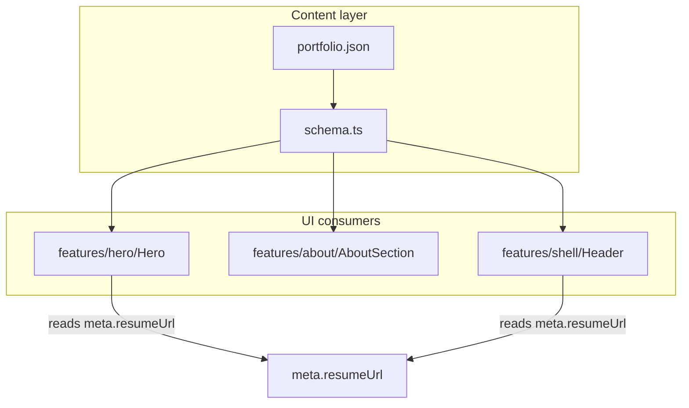

# Phase 5 — Identity & clarity

## Goal

Visitors know **who you are, what you do, and what you want** in under 10 seconds. All copy and links remain content-driven via [`portfolio.json`](src/content/portfolio.json) + [`schema.ts`](src/content/schema.ts).

## Scope (confirmed)

| Choice | Decision |
|--------|----------|
| Resume link | **Header** (desktop + mobile sheet) **and** Hero (tertiary CTA) — **single URL** from `meta.resumeUrl` |
| Resume label | **`meta.resumeLabel`** (optional, default `"Resume"` at parse/UI) |
| Avatar | **Placeholder asset** in `public/assets/` (swap real photo later) |
| Location in hero | **Out of scope** — `about.location` only, shown in About |
| SEO / OG / `<title>` | Out of scope (Phase 10) |
| Project thumbnails | Out of scope (Phase 6) |
| Planet art pass | Out of scope (Phase 8) |
| Sticky scroll CTA | Out of scope (optional later) |

---

## Current baseline

- [`Hero.tsx`](src/features/hero/Hero.tsx): eyebrow → H1 → subheadline → 2 CTAs; no role line, no resume
- [`AboutSection.tsx`](src/features/about/AboutSection.tsx): `SectionHeading` + body only; no avatar/location/openTo
- [`Header.tsx`](src/features/shell/Header.tsx): nav + primary CTA; no resume
- [`schema.ts`](src/content/schema.ts): no `hero.roleLine`, `about.avatar`, `meta.resumeUrl`, etc.
- [`portfolio.json`](src/content/portfolio.json): placeholder social URLs (`https://github.com`, etc.); `contact.message` already reads like an “open to” line
- `public/`: only [`icons.svg`](public/icons.svg) — no `assets/` yet (`ogImage` path in JSON is also unresolved until Phase 10)

---

## Architecture



**Composition order in Hero (new hierarchy):**

```
eyebrow → headline → roleLine → subheadline → CTAs (primary, secondary, resume)
```

---

## Content schema extensions

Update [`schema.ts`](src/content/schema.ts):

```ts
// hero — required role line only; NO resume href here (avoid drift)
roleLine: z.string()

// meta — single source of truth for resume
resumeUrl: z.string()   // public path, e.g. /assets/resume.pdf (not z.url() — relative paths OK)
resumeLabel: z.string().optional()  // UI default "Resume" when omitted

// about
avatar: z.string()              // required — /assets/avatar.png
avatarAlt: z.string().optional()
location: z.string().optional() // About section only (not duplicated on meta or hero)
openTo: z.string().optional()   // availability intent — NOT the contact form intro
```

**Do not add** `meta.location` or `hero.resumeCta.href`. Header and Hero both read `meta.resumeUrl` + `meta.resumeLabel`.

Optional portfolio-level refine (only if needed):

```ts
.refine(
  (data) => data.meta.resumeUrl.startsWith('/'),
  { message: 'resumeUrl must be a site-relative path', path: ['meta', 'resumeUrl'] },
)
```

---

## Content rules (avoid duplication)

| Field | Purpose | Example |
|-------|---------|---------|
| `about.openTo` | What roles/work you want | "Open to senior full-stack roles, remote-friendly." |
| `contact.message` | Form section intro only | "Send a message — I usually reply within two business days." |

**Do not** repeat the same “open to …” sentence in both fields. Update existing `contact.message` in JSON when adding `about.openTo`.

Social links: use plausible paths (e.g. `https://github.com/nova-chen`). Document in [`docs/content-schema.md`](docs/content-schema.md) that real profiles replace placeholders before personal ship (JSON cannot hold comments).

---

## Example `portfolio.json` additions

```json
"meta": {
  "resumeUrl": "/assets/resume.pdf",
  "resumeLabel": "Resume",
  "social": [
    { "label": "GitHub", "href": "https://github.com/nova-chen" },
    { "label": "LinkedIn", "href": "https://linkedin.com/in/nova-chen" },
    { "label": "Email", "href": "mailto:nova@example.com" }
  ]
},
"hero": {
  "roleLine": "Senior full-stack engineer · mission systems & operator UIs",
  ...
},
"about": {
  "avatar": "/assets/avatar.png",
  "avatarAlt": "Portrait of Nova Chen",
  "location": "Bay Area · Pacific Time",
  "openTo": "Open to full-time product engineering, consulting, and speaking on resilient systems.",
  ...
},
"contact": {
  "message": "Send a message — I usually reply within two business days.",
  ...
}
```

---

## Static assets

Add under `public/assets/` **before** enabling required `about.avatar` in schema:

| File | Purpose |
|------|---------|
| `avatar.png` | Space-themed placeholder portrait |
| `resume.pdf` | Minimal 1-page placeholder PDF |

Paths referenced only via content — no hardcoded paths in components.

---

## UI changes

### Hero ([`Hero.tsx`](src/features/hero/Hero.tsx))

- Insert **role line** (`<p>`) between H1 and subheadline — `text-lg font-medium text-primary` (or accent); not a heading level
- Tertiary **resume** control: `Button variant="ghost" size="lg"` with `render={<a href={meta.resumeUrl} target="_blank" rel="noopener noreferrer" />}` — same pattern as existing CTAs
- Label from `meta.resumeLabel ?? 'Resume'`; optional `FileText` icon from lucide
- **No** `download` attribute — open PDF in new tab only (consistent with header)

### About ([`AboutSection.tsx`](src/features/about/AboutSection.tsx))

**Do not** use monolithic `SectionHeading` above a separate avatar block — split layout:

```
md+ grid: [ avatar column | identity column ]
         [ body spans full width below        ]
```

```
┌──────────────────────────────────────────────┐
│  [avatar]     h2 About                     │
│  96–128px     subtitle                       │
│               location (muted)               │
│               openTo (Badge outline)         │
├──────────────────────────────────────────────┤
│  body paragraphs (max-w-3xl)                 │
└──────────────────────────────────────────────┘
```

- Avatar: `rounded-full` or `rounded-xl`, `border border-border/50`
- `openTo`: shadcn `Badge variant="outline"` (already in Phase 3 allowlist)
- `alt`: `about.avatarAlt` or `` `${meta.name} portrait` ``
- Optional: `AboutIdentity.tsx` subcomponent if file grows

### Header ([`Header.tsx`](src/features/shell/Header.tsx))

- Desktop: `Button variant="outline" size="sm"` for resume **between nav and primary CTA** — watch crowding; use `hidden lg:inline-flex` for resume if needed on `md` only
- Mobile sheet: resume button below nav links with **`onClick={handleNavClick}`** (same as nav anchors)
- Read `meta.resumeUrl` + `meta.resumeLabel` only

### Footer ([`Footer.tsx`](src/features/shell/Footer.tsx))

- **No changes** — social links only; no third resume link

### Contact ([`ContactSection.tsx`](src/features/contact/ContactSection.tsx))

- No code changes required — update `contact.message` in JSON only (see content rules)

---

## Documentation

| Artifact | Action |
|----------|--------|
| [`docs/content-schema.md`](docs/content-schema.md) | New fields; openTo vs contact.message; resume single source |
| [`docs/requirements.md`](docs/requirements.md) | Add **FR-10** identity clarity; move **NFR-6 SEO → Phase 10**; fix out-of-scope SEO line |
| [`docs/decisions/0011-identity-content-presentation.md`](docs/decisions/0011-identity-content-presentation.md) | **New ADR**: role line hierarchy, resume URL rule, avatar/openTo rules |
| [`docs/roadmap.md`](docs/roadmap.md) | Mark Phase 5 in progress when starting |
| [`src/features/hero/AGENTS.MD`](src/features/hero/AGENTS.MD) | Update: roleLine, resume from meta |
| [`src/features/about/AGENTS.MD`](src/features/about/AGENTS.MD) | Update: avatar, location, openTo layout |
| [`src/features/shell/AGENTS.MD`](src/features/shell/AGENTS.MD) | Update: header resume from meta |
| [`AGENTS.MD`](AGENTS.MD) | ADR 0011 in checklist |

---

## Testing (Playwright)

Extend [`e2e/home.spec.ts`](e2e/home.spec.ts) under `describe('Phase 5 identity')`:

- Hero **role line** text from JSON
- **Header resume**: scope to `banner` — `getByRole('button', { name: 'Resume' })` + assert `href` contains `resume.pdf` (matches existing Button-as-link pattern)
- **Hero resume**: scope to `#hero` — same button role + href
- About **`img`** visible with non-empty `alt`
- **`about.openTo`** and **`about.location`** visible
- Assert **`contact.message`** is distinct from `about.openTo` (different strings)

Do **not** use unscoped `getByRole('link', { name: 'Resume' })` — resume uses shadcn Button, not native link role.

---

## Acceptance criteria

- Recruiter scan: headline + role line answer “what do they do?” without reading body
- Resume opens from header and hero; both use **`meta.resumeUrl`**
- About shows avatar, location, openTo; contact message is **not** a duplicate openTo
- Reduced-motion / 3D / starfield unchanged
- `npm run typecheck`, `lint`, `build`, `test:e2e` pass
- No hardcoded marketing copy in feature TSX — only `loadPortfolio()`
- Requirements doc reflects SEO as Phase 10

---

## Implementation order

1. Placeholder assets (`public/assets/`)
2. Schema + `portfolio.json` (including differentiated contact.message)
3. Hero role line + resume from meta
4. About identity grid layout
5. Header + mobile sheet resume
6. ADR 0011 + docs + AGENTS
7. Playwright + verify gate

---

## Out of scope (explicit)

- Dynamic `<title>` / meta tags (Phase 10)
- `location` under hero role line
- `hero.resumeCta` duplicate href
- Project `image` field (Phase 6)
- Token/color overhaul (Phase 7)
- Planet materials (Phase 8)
- Footer resume link
- Real GitHub/LinkedIn URLs (content edit before personal ship)
