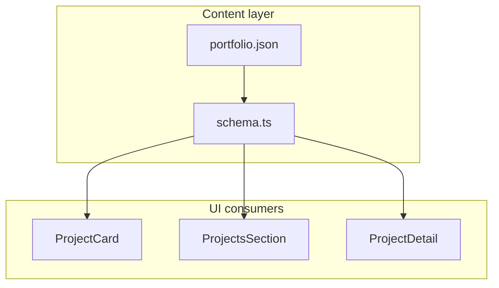

# Phase 6 — Project case studies

## Goal

Projects prove **impact**, not just existence. All copy and metadata stay in [`portfolio.json`](src/content/portfolio.json); UI reads via [`schema.ts`](src/content/schema.ts) only.

## Current baseline

- [`projectSchema`](src/content/schema.ts): `title`, `slug`, `summary`, `body[]`, `tech[]`, `href?`, `repo?`, `featured`
- [`ProjectCard.tsx`](src/features/projects/ProjectCard.tsx): text-only card, stretched link, no thumbnail
- [`ProjectDetail.tsx`](src/features/projects/ProjectDetail.tsx): title → summary → tech → body → CTAs; no hero image or metrics
- [`ProjectsSection.tsx`](src/features/projects/ProjectsSection.tsx): uniform 3-col grid; featured only filters via tabs
- 3 projects in JSON; no `public/assets/projects/` yet
- E2E: [`e2e/projects.spec.ts`](e2e/projects.spec.ts) covers tabs, basic detail, 404 — no image/outcomes



---

## Scope (confirmed from roadmap)

| In scope | Out of scope |
|----------|--------------|
| Schema: `image`, `imageAlt`, `role`, `outcomes[]`, `year`, `domain`, `flagship` | Video embeds, interactive demos |
| Thumbnail on every card; featured + flagship visual treatment | Per-project WebGL |
| Detail: hero image, meta row, metrics strip, body, live/repo CTAs | Full visual token overhaul (Phase 7) |
| One flagship case study (`orbital-telemetry`) | Dynamic SEO / OG (Phase 10) |
| Placeholder images under `public/assets/projects/` | |

**Content narrative:** problem → role → outcomes with metrics → long-form body. Problem stays in `body[0]` (no new `problem` field); structured fields carry scannable metadata.

---

## Schema extensions

Update [`src/content/schema.ts`](src/content/schema.ts):

```ts
const projectOutcomeSchema = z.object({
  value: z.string(),  // e.g. "40%", "<2s", "3 teams"
  label: z.string(),  // e.g. "Faster incident response"
})

// extend projectSchema:
image: z.string().optional(),
imageAlt: z.string().optional(),
role: z.string().optional(),
year: z.number().int().min(2000).max(2100).optional(),
domain: z.string().optional(),
outcomes: z.array(projectOutcomeSchema).min(1).optional(),
flagship: z.boolean().default(false),
```

**Portfolio refine** (ship gate for demo content — all 3 projects must satisfy):

```ts
.refine(
  (data) => data.projects.every((p) => p.image && (p.outcomes?.length ?? 0) >= 1),
  { message: 'Every project must include image and at least one outcome', path: ['projects'] },
)
```

Export `ProjectOutcome` type if needed for subcomponents.

**Image paths:** site-relative like Phase 5 avatar — e.g. `/assets/projects/orbital-telemetry.png`. Optional refine: `image.startsWith('/')`.

---

## Static assets

Add under `public/assets/projects/` **before** enabling portfolio refine:

| File | Role |
|------|------|
| `orbital-telemetry.png` | Flagship — richest visual (mission console / telemetry theme) |
| `nebula-ds.png` | Design system / component library theme |
| `launch-pad-ci.png` | CI / pipeline theme |

16:9 or 3:2 aspect ratio (~800×450) works for card thumbnail + detail hero. Generate space-themed placeholders (same approach as `avatar.png`); swap real screenshots before personal ship.

---

## Content updates ([`portfolio.json`](src/content/portfolio.json))

For each project add `image`, `imageAlt`, `role`, `year`, `domain`, `outcomes` (min 1 metric each). Expand `body` to follow case-study flow (problem paragraph first).

**Flagship:** `orbital-telemetry` — set `flagship: true`, 3 outcomes, longest body, best image.

Example shape:

```json
{
  "title": "Orbital Telemetry Console",
  "slug": "orbital-telemetry",
  "summary": "...",
  "role": "Lead frontend engineer",
  "year": 2024,
  "domain": "Mission operations",
  "image": "/assets/projects/orbital-telemetry.png",
  "imageAlt": "Orbital Telemetry Console dashboard",
  "outcomes": [
    { "value": "<2s", "label": "Anomaly detection latency" },
    { "value": "40%", "label": "Faster operator response" }
  ],
  "flagship": true,
  "body": ["Problem paragraph...", "Approach...", "Results..."],
  ...
}
```

---

## UI changes

### [`ProjectCard.tsx`](src/features/projects/ProjectCard.tsx)

- Thumbnail `` at top (`aspect-video`, `object-cover`, `rounded-lg`, border)
- Below title: optional meta line — `domain · year` (muted `text-xs`)
- `role` as one-line subtitle under title or above summary (`text-sm text-muted-foreground`)
- **Featured treatment:** `ring-1 ring-accent/30` + subtle glow when `featured`
- **Flagship treatment:** when `flagship`, card spans `lg:col-span-2` in grid (handled in parent list item className)
- Preserve stretched-link pattern ([`docs/patterns.md`](docs/patterns.md))

### [`ProjectsSection.tsx`](src/features/projects/ProjectsSection.tsx)

- Pass `className` to list item: `flagship ? 'lg:col-span-2' : ''`
- Optional: sort featured/flagship first in **All** tab (flagship first, then featured, then rest)

### [`ProjectDetail.tsx`](src/features/projects/ProjectDetail.tsx)

Layout order:

```
← Back
[hero image — full width, aspect-video, rounded-xl]
h1 title
meta row: domain · year · role
summary
[metrics strip — outcomes grid]
tech badges
body paragraphs
live + repo CTAs
```

**Metrics strip:** horizontal grid of outcome cards (`value` large/accent, `label` muted below). 2–3 cols on `md+`, stack on mobile. Extract `ProjectOutcomesStrip.tsx` only if `ProjectDetail` exceeds ~100 lines.

**Hero image:** reuse `project.image` + `imageAlt ?? project.title`; `loading="eager"` on detail (lazy on cards).

### No changes

- [`ProjectDetailPage.tsx`](src/features/projects/ProjectDetailPage.tsx) — still passes `project` to `ProjectDetail`
- Routing, barrel exports, cross-feature boundaries unchanged

---

## Documentation

| Artifact | Action |
|----------|--------|
| [`docs/decisions/0012-project-case-studies.md`](docs/decisions/0012-project-case-studies.md) | **New ADR:** outcome shape, image paths, flagship vs featured, detail layout |
| [`docs/content-schema.md`](docs/content-schema.md) | New project fields + outcomes table |
| [`docs/requirements.md`](docs/requirements.md) | Extend **FR-5** for case-study fields and detail metrics strip |
| [`docs/roadmap.md`](docs/roadmap.md) | Mark Phase 6 in progress → complete when done |
| [`src/features/projects/AGENTS.MD`](src/features/projects/AGENTS.MD) | Thumbnail, metrics strip, flagship grid |
| [`AGENTS.MD`](AGENTS.MD) | ADR 0012 in checklist |

---

## Testing (Playwright)

Extend [`e2e/projects.spec.ts`](e2e/projects.spec.ts) with `describe('Phase 6 case studies')`:

- **Card thumbnail:** `#projects img` visible for orbital-telemetry card (scope via link ancestor or alt text)
- **Flagship layout:** on `lg` viewport, flagship card spans wider grid (optional: count grid columns or check `col-span` class via locator)
- **Detail hero image:** `/projects/orbital-telemetry` — `img` with expected `alt`
- **Metrics strip:** outcome value + label visible (e.g. `"<2s"`, `"Anomaly detection latency"`)
- **Meta row:** `role`, `domain`, or `year` visible on detail page
- Existing tab/detail/404 tests must still pass

---

## Acceptance criteria

- Every project in JSON has `image` + ≥1 outcome (enforced by refine)
- Featured work visually distinct on grid; flagship (`orbital-telemetry`) is obvious
- Detail pages read as case studies: hero image, metrics, role/context, long body, CTAs
- No hardcoded project copy in TSX
- `npm run typecheck`, `lint`, `build`, `test:e2e` pass
- 3D / starfield / reduced-motion unchanged

---

## Implementation order

1. Placeholder images in `public/assets/projects/`
2. Schema + `portfolio.json` (refine + flagship content)
3. `ProjectCard` thumbnail + featured/flagship styling
4. `ProjectsSection` grid span + sort
5. `ProjectDetail` hero + meta + metrics strip
6. ADR 0012 + docs + AGENTS
7. Playwright + verify gate
