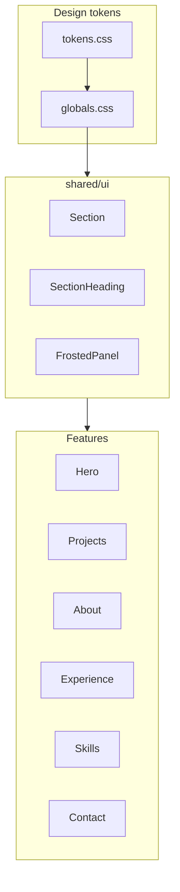

# Phase 7 — Visual design system

## Goal

Site feels designed as **one product**, not sections bolted together. No new content fields, sections, planet art, or SEO — polish tokens, typography, rhythm, and shared components only.

## Confirmed choices

| Decision | Choice |
|----------|--------|
| Section rhythm | **Alternating subtle nebula bands** on even-index home sections (Projects, Experience, Contact) |
| Typography | **Geist Variable for headings only**; system-ui stack for body |
| Out of scope | Planet shaders (Phase 8), SEO (Phase 10), new sections |

---

## Current baseline

- Tokens in [`src/styles/tokens.css`](src/styles/tokens.css) — void/nebula/accent palette; `--color-star-dim` may be borderline for WCAG small text on void
- Bridge in [`src/styles/globals.css`](src/styles/globals.css); Geist in `package.json` but **not imported**
- [`Section`](src/shared/ui/Section.tsx) — uniform `py-[var(--section-padding-y)]`; no band variant
- [`SectionHeading`](src/shared/ui/SectionHeading.tsx) — used by Projects, Experience, Skills, Contact; **About uses custom `h2`**
- Frosted card classes **duplicated** in [`ProjectCard.tsx`](src/features/projects/ProjectCard.tsx), [`ExperienceSection.tsx`](src/features/experience/ExperienceSection.tsx), [`ProjectOutcomesStrip.tsx`](src/features/projects/ProjectOutcomesStrip.tsx) (same string from [`docs/patterns.md`](docs/patterns.md))
- Hero uses bespoke padding/typography in [`Hero.tsx`](src/features/hero/Hero.tsx); shell chrome governed by [ADR 0007](docs/decisions/0007-canvas-interaction-ux.md)



---

## 1. Token and contrast pass

Update [`src/styles/tokens.css`](src/styles/tokens.css) and bridge in [`globals.css`](src/styles/globals.css):

- **Muted text:** Lighten `--color-star-dim` until **≥ 4.5:1** against `--color-void` for normal text (document chosen ratio in ADR)
- **Depth tokens:** Add optional `--color-nebula-band` (subtle band background, e.g. `color-mix` of nebula-light at ~12–18% opacity over void)
- **Glow balance:** Tune `--color-accent-glow` / `--shadow-glow` if featured rings feel harsh after contrast bump
- **Type scale CSS vars** (reference only, used by SectionHeading + docs):

```css
--text-display: clamp(2.25rem, 5vw, 3.75rem);   /* hero h1 */
--text-section: clamp(1.875rem, 3vw, 2.25rem); /* h2 */
--text-lead: 1.125rem;
--text-body: 1rem;
--text-small: 0.875rem;
```

No hardcoded hex in feature TSX — tokens or Tailwind semantic classes only.

---

## 2. Typography — Geist display

- Import in [`src/main.tsx`](src/main.tsx) or `globals.css`:

```ts
import '@fontsource-variable/geist'
```

- Set in `tokens.css`:

```css
--font-display: 'Geist Variable', system-ui, sans-serif;
--font-body: system-ui, sans-serif;  /* unchanged */
```

- Apply via existing `h1,h2,h3 { font-family: var(--font-display) }` in `globals.css`
- Hero keeps display sizing; align `SectionHeading` to `--text-section` scale (replace raw `text-3xl md:text-4xl` with token-based classes or shared utilities)

---

## 3. Extract `FrostedPanel` shared component

New [`src/shared/ui/FrostedPanel.tsx`](src/shared/ui/FrostedPanel.tsx):

```tsx
// rounded-xl border border-border/50 bg-card/40 backdrop-blur-sm
// hover:border-accent/40 hover:bg-card/60 (optional via prop)
// accepts as="article" | "div", className, children
```

Refactor consumers (minimal API surface):

| File | Change |
|------|--------|
| [`ProjectCard.tsx`](src/features/projects/ProjectCard.tsx) | Wrap content in `FrostedPanel`; keep featured ring on outer article |
| [`ExperienceSection.tsx`](src/features/experience/ExperienceSection.tsx) | Replace inline article classes |
| [`ProjectOutcomesStrip.tsx`](src/features/projects/ProjectOutcomesStrip.tsx) | Use `FrostedPanel` per metric cell |

Export from [`src/shared/ui/index.ts`](src/shared/ui/index.ts); document in [`docs/patterns.md`](docs/patterns.md) (replace duplicated class string).

---

## 4. Section rhythm — alternating bands

Extend [`Section.tsx`](src/shared/ui/Section.tsx):

```tsx
variant?: 'default' | 'band'  // band → subtle nebula background + optional top/bottom border
```

Band style (conceptual):

```css
bg-[color-mix(in_srgb,var(--color-nebula-light)_14%,transparent)]
border-y border-border/20
```

Apply in [`HomePage.tsx`](src/features/home/HomePage.tsx) — band on **even** sections after hero:

| Section | Band |
|---------|------|
| Hero | default (transparent over starfield) |
| Projects | **band** |
| About | default |
| Experience | **band** |
| Skills | default |
| Contact | **band** |

Hero/About/Skills stay transparent so identity and skills breathe against starfield; projects/experience/contact get subtle grounding.

---

## 5. Consistent `SectionHeading`

- **About:** Refactor [`AboutSection.tsx`](src/features/about/AboutSection.tsx):
  - `SectionHeading` with `about.title` + `about.subtitle` **above** the avatar grid (full width)
  - Grid below: avatar | location + openTo + body (drop duplicate `h2`)
- **Project detail:** Optional `SectionHeading`-aligned title styles in [`ProjectDetail.tsx`](src/features/projects/ProjectDetail.tsx) (same `text-section` scale as section h2s)
- No change to hero h1 hierarchy (intentionally display-tier)

---

## 6. Shell and mobile polish

Per roadmap + [ADR 0007](docs/decisions/0007-canvas-interaction-ux.md) (amend only if opacity values change):

| Area | Tweak |
|------|-------|
| **Header** | Ensure header CTAs meet **44×44px** min tap target on mobile (`size="sm"` buttons — add `min-h-11 min-w-11` or `size="default"` on mobile via responsive classes) |
| **Hero mobile** | Reduce top padding slightly (`pt-10` mobile) so primary CTA is **above fold** on 667px viewport |
| **Footer** | Verify band sections don't visually collide with footer shadow; adjust `mt-auto` spacing if needed |
| **Focus states** | Confirm stretched-link cards retain `focus-visible:ring-2` after FrostedPanel extraction |

Do **not** increase header/footer opacity without ADR 0007 amendment note in ADR 0013.

---

## 7. Documentation

| Artifact | Action |
|----------|--------|
| [`docs/decisions/0013-visual-design-system.md`](docs/decisions/0013-visual-design-system.md) | **New ADR:** token changes, Geist display-only, band rhythm, FrostedPanel, contrast target |
| [`docs/visual-principles.md`](docs/visual-principles.md) | **New:** short principles (depth, frost, accent discipline, type hierarchy, motion respect) |
| [`docs/patterns.md`](docs/patterns.md) | FrostedPanel pattern; section band usage; typography table |
| [`docs/requirements.md`](docs/requirements.md) | Add **NFR-9** or extend **FR-3**: unified visual system, WCAG muted-text contrast |
| [`docs/roadmap.md`](docs/roadmap.md) | Mark Phase 7 in progress → complete |
| [`src/shared/AGENTS.MD`](src/shared/AGENTS.MD) | FrostedPanel, Section variants |
| [`AGENTS.MD`](AGENTS.MD) | ADR 0013 in checklist |

---

## 8. Testing (Playwright)

Extend [`e2e/home.spec.ts`](e2e/home.spec.ts) under `describe('Phase 7 visual system')`:

- **Mobile hero CTA above fold:** viewport 375×667; `#hero` primary button visible without scroll
- **Section bands:** `#projects` section has band background class or data attribute (add `data-section-variant="band"` on Section for stable selector)
- **Geist loaded:** optional check that computed `font-family` on `h2` includes `Geist` (or skip if flaky in CI)
- **FrostedPanel focus:** tab to a project card link; `focus-visible` ring present

Manual contrast note in ADR (automated axe optional future work — not required for Phase 7 gate).

Existing 18 e2e tests must still pass.

---

## Acceptance criteria

- Clear visual cohesion vs Phase 6: shared FrostedPanel, band rhythm, unified section titles
- Muted text meets documented WCAG contrast target on void background
- Geist on headings only; body remains system-ui
- No hardcoded hex in feature TSX
- Starfield / 3D / reduced-motion unchanged
- `npm run typecheck`, `lint`, `build`, `test:e2e` pass

---

## Implementation order

1. Token + contrast pass; Geist import + font tokens
2. `FrostedPanel` + refactor project/experience/outcomes
3. `Section` band variant + HomePage band assignment
4. About `SectionHeading` refactor + detail title alignment
5. Shell/mobile hero polish
6. ADR 0013 + visual-principles + docs
7. Playwright + verify gate
