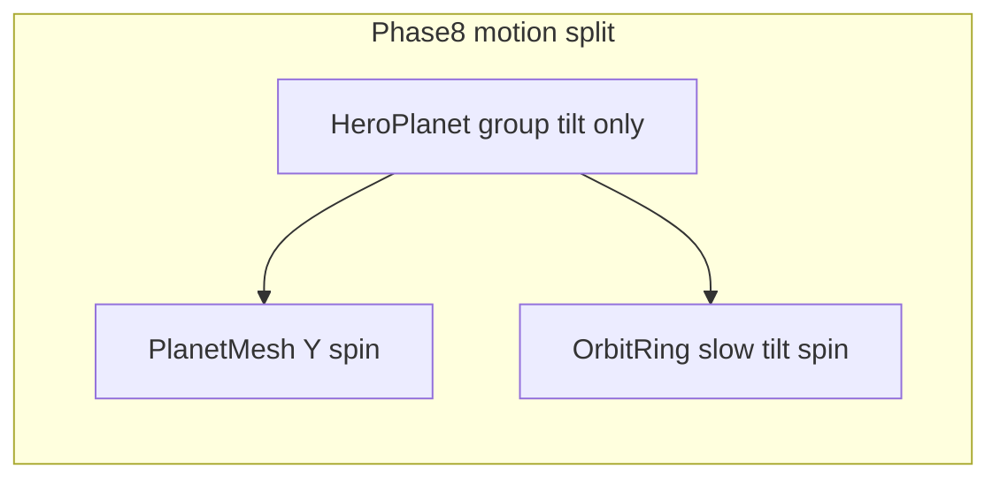

# Phase 8 — Hero planet and motion craft

## Current state

| Piece | Today | Gap |
|-------|--------|-----|
| [`PlanetMesh.tsx`](src/features/scene3d/PlanetMesh.tsx) | Single `icosahedronGeometry` + `meshStandardMaterial` (orbit color, accent emissive) | Reads as generic low-poly demo |
| [`HeroPlanet.tsx`](src/features/scene3d/HeroPlanet.tsx) | **Whole group** rotates via `useFrame` | Ring and planet spin together — not “ring vs planet” |
| [`OrbitRing.tsx`](src/features/scene3d/OrbitRing.tsx) | Static torus, no `useFrame` | No independent motion |
| [`HeroPlanetSceneInner.tsx`](src/features/scene3d/HeroPlanetSceneInner.tsx) | Hardcoded light hex (`#00d4aa`, `#6b5ce7`) | Should use [`readSceneColors()`](src/features/scene3d/lib/colors.ts) per ADR 0010 |
| [`Scene3DFallback.tsx`](src/features/scene3d/Scene3DFallback.tsx) | Custom radial stack | Hero blur already uses [`--hero-planet-glow`](src/styles/tokens.css) — fallback should match |
| Bloom / postprocessing | None | Roadmap: optional only if perf OK — **default: skip** |

Integration unchanged: [`Hero.tsx`](src/features/hero/Hero.tsx) → lazy [`HeroPlanetScene`](src/features/scene3d/HeroPlanetScene.tsx) → `data-scene3d="hero"`, reduced-motion → fallback only.

## Implementation plan

### 1. Constants and colors

- Extend [`lib/constants.ts`](src/features/scene3d/lib/constants.ts):
  - `PLANET_ROTATION_SPEED` (rename from shared `ROTATION_SPEED` or split)
  - `RING_ROTATION_SPEED` (slower, e.g. ~0.12)
  - `ATMOSPHERE_SCALE` (~1.04–1.06)
- Optionally extend [`lib/colors.ts`](src/features/scene3d/lib/colors.ts) with `--color-void` for dark hemisphere (fallback `#050510`).

### 2. Layered planet (no GLTF, no postprocessing)

Refactor [`PlanetMesh.tsx`](src/features/scene3d/PlanetMesh.tsx) (or add `PlanetAtmosphere.tsx` sibling):

- **Core:** icosahedron `detail={3}`, `meshStandardMaterial` — orbit base, low emissive, tuned `roughness`/`metalness` for readable terminator.
- **Atmosphere:** slightly larger sphere, `transparent` + low `opacity`, accent-tinted emissive, `depthWrite={false}` for halo (standard material only — stays within ADR 0010 mesh budget).
- **Rim:** driven by lights (step 3), not extra passes.

Keep `autoRotate` on planet only; respect `document.hidden` pause (existing pattern).

### 3. Independent ring motion

- [`OrbitRing.tsx`](src/features/scene3d/OrbitRing.tsx): add `useFrame` rotating ring mesh on its own axis (e.g. slow roll on local X/Z) at `RING_ROTATION_SPEED`.
- [`HeroPlanet.tsx`](src/features/scene3d/HeroPlanet.tsx): **remove** group-level `useFrame` rotation; keep static tilt `rotation={[0.14, 0.35, 0]}` only.

### 4. Token-aligned lighting

Update [`HeroPlanetSceneInner.tsx`](src/features/scene3d/HeroPlanetSceneInner.tsx):

- Read `accent` / `orbit` from `readSceneColors()` once (memo).
- Replace hardcoded point light colors with token values.
- Add **directionalLight** from upper-right (accent) for rim; soften ambient so void side reads dark.
- Keep mesh count: planet + atmosphere + ring + lights only (no shadows).

### 5. CSS fallback parity

Update [`Scene3DFallback.tsx`](src/features/scene3d/Scene3DFallback.tsx):

- Background: `var(--hero-planet-glow)` (same token as hero blur in `Hero.tsx`).
- Optional thin ring hint via pseudo-element or second absolutely positioned border ring (CSS only, `prefers-reduced-motion` path).
- Match responsive sizes already used (`size-36` … `lg:size-60`).

### 6. Bloom decision (explicit gate)

- **Do not** add `@react-three/postprocessing` or EffectComposer in the first pass.
- After visual pass: quick manual check (desktop + mobile DPR cap, tab hidden pause). If frame time regresses, document “bloom deferred” in ADR 0010 amendment.
- Only add bloom if build stays smooth and e2e green — otherwise note in plan completion.

### 7. Documentation

- Amend [`docs/decisions/0010-scene3d-performance.md`](docs/decisions/0010-scene3d-performance.md): layered meshes (core + atmosphere), split rotation speeds, token lights, fallback token, bloom in/out.
- Update [`src/features/scene3d/AGENTS.MD`](src/features/scene3d/AGENTS.MD) and cross-link from [`docs/decisions/0013-visual-design-system.md`](docs/decisions/0013-visual-design-system.md) (hero-planet-glow ↔ 3D).
- Mark Phase 8 complete in [`docs/roadmap.md`](docs/roadmap.md) when done.

### 8. Verification

- Existing [`e2e/scene3d.spec.ts`](e2e/scene3d.spec.ts): keep WebGL error, reduced-motion no canvas, lazy canvas load.
- Add: fallback orb uses `--hero-planet-glow` (evaluate computed `background` includes token or data attribute on fallback).
- Run: `npm run typecheck`, `npm run lint`, `npm run build` (confirm `three` chunk still separate), `npm run test:e2e`.

## Out of scope (per roadmap)

OrbitControls, clickable meshes, GLTF imports, second WebGL mount, `#orbit` revival, heavy postprocessing stack.

## Done when

- Planet reads branded (layered surface + rim + atmosphere), ring and planet rotate at different rates.
- Reduced-motion fallback visually matches hero glow token.
- ADR 0010 updated; perf caps unchanged; 35+ e2e tests pass.
