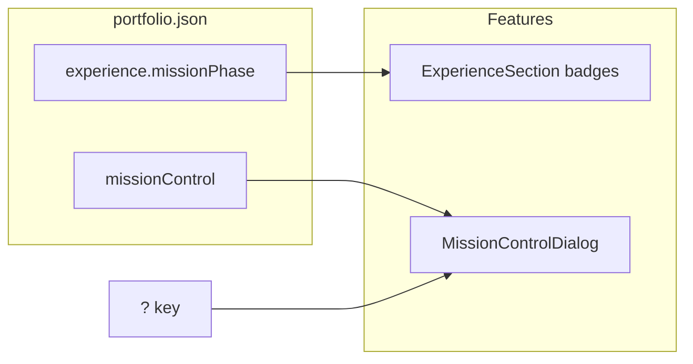

# Phase 9 — Delight & theme

## Recommendation (chosen for you)

| Pick | Why |
|------|-----|
| **B — Mission timeline** | Experience already has a timeline ([`ExperienceSection.tsx`](src/features/experience/ExperienceSection.tsx)); copy is mission-themed; 2 JSON entries map cleanly to **Launch** (past) + **Orbit** (present). |
| **C — Easter egg** (+ links) | Memorable, lazy-friendly dialog; fold **E — Transmission log** into the panel (no extra section clutter). |
| **Defer A, D** | A needs tooltip + hero/canvas hit targets (conflicts with `pointer-events-none` starfield). D is a static block with less “delight” per effort. |

---

## 1. Content model

Extend [`src/content/schema.ts`](src/content/schema.ts):

- **`experience[].missionPhase`** (optional): `'launch' | 'orbit' | 'dock'`
- **`missionControl`** object:
  - `title`, `hint` (e.g. “Press **?** for mission control”)
  - `shortcuts`: `{ label, href }[]` (mirror nav: Projects, Contact, Resume)
  - `transmissions`: `{ label, href, kind?: 'article' | 'talk' }[]` (2–3 items)

Update [`src/content/portfolio.json`](src/content/portfolio.json):

- Stellar (present) → `orbit`; Astra → `launch`
- Sample transmissions (placeholder URLs) + shortcuts

Add **`inferMissionPhase(item, index, total)`** in [`src/features/experience/`](src/features/experience/) when `missionPhase` omitted:

- `end === 'present'` → `orbit`
- oldest entry (last index) → `launch`
- middle entries (if 3+) → `dock`

Document in [`docs/content-schema.md`](docs/content-schema.md).

---

## 2. Mission timeline UI (B)

In [`ExperienceSection.tsx`](src/features/experience/ExperienceSection.tsx) / new small helper `missionPhase.ts`:

- Map phase → label + token styling (Launch / Orbit / Dock badges using existing primary/accent discipline per [visual-principles.md](docs/visual-principles.md))
- Show phase badge near timeline dot or under role title (present role keeps “Current” + phase)
- Optional compact **legend** under [`experienceSection`](src/content/portfolio.json) subtitle (3 labels, no extra interaction)

Amend [`docs/decisions/0009-experience-content-presentation.md`](docs/decisions/0009-experience-content-presentation.md) (mission phases, inference rules).

---

## 3. Mission control easter egg (C + E)

**shadcn**: `npx shadcn@latest add dialog` per [`.cursor/skills/add-shadcn-component/SKILL.md`](.cursor/skills/add-shadcn-component/SKILL.md).

New feature module (suggested): [`src/features/mission-control/`](src/features/mission-control/)

- `MissionControlDialog.tsx` — shadcn Dialog, content from `loadPortfolio().missionControl`
- `useMissionControlShortcut.ts` — `?` toggles open; **ignore** when focus is in `input`, `textarea`, or `contenteditable`; respect reduced motion (panel is static—no animation dependency)
- Wire once in [`src/features/shell/Layout.tsx`](src/features/shell/Layout.tsx) (or `AppShell`) so it works on all routes
- Footer hint optional: one line in shell/footer “Press ? for mission control” from `missionControl.hint` (subtle, `text-xs`)

**A11y**: Dialog focus trap via shadcn; `aria-label` on trigger not needed (keyboard-only); document Escape to close in e2e.

**Perf**: Dialog chunk loads with shell (small); no canvas/WebGL changes.

---

## 4. Documentation & roadmap

- **New ADR** [`docs/decisions/0014-phase9-delight.md`](docs/decisions/0014-phase9-delight.md): scope (B+C), deferred A/D, keyboard rules, reduced-motion, no gamification
- Mark **Phase 9 complete** in [`docs/roadmap.md`](docs/roadmap.md)
- Add FR-11 (mission phases + mission control) to [`docs/requirements.md`](docs/requirements.md)
- [`src/features/mission-control/AGENTS.MD`](src/features/mission-control/AGENTS.MD) + link from [`src/features/AGENTS.MD`](src/features/AGENTS.MD)
- Note Phase 11 will re-verify reduced-motion for mission-control (already static)

---

## 5. Verification

**E2e** (new [`e2e/mission-control.spec.ts`](e2e/mission-control.spec.ts)):

- Press `?` → dialog visible with title from JSON
- `Escape` closes
- `?` does not fire when focus in contact form field

Extend [`e2e/experience.spec.ts`](e2e/experience.spec.ts):

- Experience cards show **Launch** / **Orbit** labels for demo content

**Commands**: `npm run typecheck`, `lint`, `build`, `test:e2e` (target 38+ tests).

---

## Out of scope (per roadmap)

Constellation hotspots, blog CMS, chat, heavy gamification, testimonial block (unless you add D later as a one-line JSON field).

## Done when

- Experience entries show mission phase; inference works without explicit JSON
- `?` opens mission-control panel with shortcuts + transmissions; keyboard/a11y sane
- ADR 0014 + roadmap Phase 9 complete; build + e2e green
