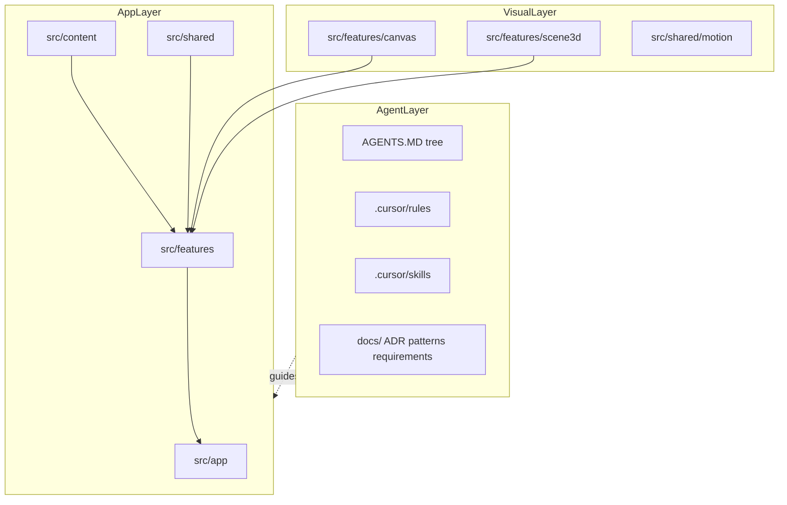
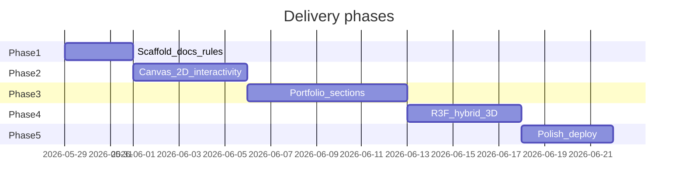

# Space Portfolio — Agentic Codebase Plan

## Context

- **Workspace**: empty ([`/Users/souravgarg/sourav/proj1`](/Users/souravgarg/sourav/proj1)) — greenfield.
- **Stack**: React 19 + Vite 6 + TypeScript + Tailwind CSS v4.
- **Theme**: space (cosmic palette, starfield, parallax, orbital motifs).
- **Interactivity**: hybrid — **2D Canvas/CSS hero** + **selective 3D** (React Three Fiber) in dedicated sections later.
- **Content**: structured **placeholders + schema** (JSON/MD), not hardcoded in components.
- **Phase 1 scope** (this plan’s execution target): scaffold, docs, agent harness, minimal runnable shell — **not** full portfolio sections yet.

---

## High-level architecture



**Design principles (agent-first)**

| Principle | Implementation |
|-----------|----------------|
| Content vs UI | All copy/projects/links in [`src/content/`](/Users/souravgarg/sourav/proj1/src/content) + Zod-validated schema |
| Feature isolation | One folder per section (`hero`, `about`, `projects`, etc.) with local `AGENTS.MD` |
| Thin routing shell | [`src/app/`](/Users/souravgarg/sourav/proj1/src/app) wires layout + lazy routes only |
| Visual split | 2D in `canvas/`, 3D in `scene3d/` — never mix WebGL into generic UI components |
| Document decisions | ADRs in [`docs/decisions/`](/Users/souravgarg/sourav/proj1/docs/decisions) |
| Safe agent boundaries | Cursor rules: Always / Ask first / Never |

---

## Target directory structure (after Phase 1)

```
proj1/
├── .cursor/
│   ├── rules/                    # Project-level agent rules (.mdc)
│   └── skills/                   # Project skills (add-section, content-update)
├── .gitnexus/                    # After first analyze (optional Phase 1 tail)
├── docs/
│   ├── README.md                 # Doc index + how agents should navigate
│   ├── requirements.md           # Functional + non-functional requirements
│   ├── patterns.md               # Code patterns (components, hooks, motion)
│   ├── content-schema.md         # Human-readable content field guide
│   ├── roadmap.md                # Phased delivery (links to todos)
│   └── decisions/
│       ├── 0001-tech-stack.md
│       ├── 0002-agentic-structure.md
│       ├── 0003-hybrid-visuals.md
│       └── 0004-content-driven-ui.md
├── public/
│   └── assets/                   # Placeholder manifest (fonts, textures later)
├── src/
│   ├── AGENTS.MD                 # Root app map for agents
│   ├── app/
│   │   ├── AGENTS.MD
│   │   ├── App.tsx
│   │   ├── routes.tsx
│   │   └── providers.tsx
│   ├── content/
│   │   ├── AGENTS.MD
│   │   ├── schema.ts             # Zod schemas
│   │   ├── portfolio.json        # Placeholder data
│   │   └── index.ts              # load + validate
│   ├── features/
│   │   ├── AGENTS.MD
│   │   ├── shell/                # Layout, nav, footer stubs
│   │   └── hero/                 # Phase 1: static shell only (2D wired Phase 2)
│   ├── shared/
│   │   ├── AGENTS.MD
│   │   ├── ui/                   # Button, Section, Container
│   │   ├── hooks/
│   │   ├── lib/                  # cn(), constants
│   │   └── types/
│   ├── styles/
│   │   ├── globals.css
│   │   └── tokens.css            # Space theme CSS variables
│   └── main.tsx
├── AGENTS.MD                     # Repo root entry for agents
├── README.md                     # Human onboarding
├── package.json
├── vite.config.ts
├── tsconfig.json
├── eslint.config.js
└── .env.example
```

---

## Phase 1 — Initialize project (execute first)

### 1.1 Bootstrap Vite + React + TypeScript

```bash
npm create vite@latest . -- --template react-ts
npm install
npm install -D tailwindcss @tailwindcss/vite
npm install zod clsx tailwind-merge
npm install react-router-dom
# Phase 2+ (document in ADR, do NOT install in Phase 1 unless stub types needed):
# @react-three/fiber @react-three/drei three framer-motion
```

- Configure [`vite.config.ts`](vite.config.ts) with `@tailwindcss/vite` plugin and path alias `@/` → `src/`.
- Enable strict TypeScript in [`tsconfig.app.json`](tsconfig.app.json).
- Add scripts: `dev`, `build`, `preview`, `lint`, `typecheck`.

### 1.2 Tailwind + space design tokens

In [`src/styles/tokens.css`](src/styles/tokens.css) define CSS variables:

- `--color-void`, `--color-nebula`, `--color-star`, `--color-orbit`, `--color-accent`
- Typography scale, spacing, glow shadows
- `prefers-reduced-motion` overrides (required for accessibility ADR)

Wire in [`src/styles/globals.css`](src/styles/globals.css) with `@import "tailwindcss"` (Tailwind v4 style).

### 1.3 Content schema + placeholders

[`src/content/schema.ts`](src/content/schema.ts) — Zod models:

- `SiteMeta` (name, title, description, ogImage, social links)
- `NavItem[]`
- `HeroContent`
- `AboutContent`
- `Project[]` (title, slug, summary, tech, links, featured)
- `Experience[]`, `Skills[]`, `Contact`

[`src/content/portfolio.json`](src/content/portfolio.json) — realistic placeholder copy (space-themed sample persona OK).

[`src/content/index.ts`](src/content/index.ts) — `loadPortfolio()` validates at build/runtime and exports typed object.

### 1.4 Minimal runnable app shell

- [`src/app/providers.tsx`](src/app/providers.tsx) — Router + future theme/context stubs
- [`src/app/routes.tsx`](src/app/routes.tsx) — single route `/` → `Hero` stub inside `Shell`
- [`src/features/shell/`](src/features/shell/) — `Layout`, `Header`, `Footer` reading nav from content
- [`src/features/hero/Hero.tsx`](src/features/hero/Hero.tsx) — static hero using content + tokens (no canvas yet)
- [`src/shared/ui/`](src/shared/ui/) — `Container`, `Section`, `Button` with Tailwind + `cn()` helper in [`src/shared/lib/cn.ts`](src/shared/lib/cn.ts)

### 1.5 Agentic documentation harness

| Artifact | Purpose |
|----------|---------|
| Root [`AGENTS.MD`](AGENTS.MD) | Repo map, commands, module index, agent workflow |
| Per-folder `AGENTS.MD` | `src/`, `src/app/`, `src/content/`, `src/features/`, `src/shared/` |
| [`docs/requirements.md`](docs/requirements.md) | FR/NFR: interactivity, a11y, performance budgets, SEO |
| [`docs/patterns.md`](docs/patterns.md) | Feature folder rules, naming, imports (`@/`), lazy loading |
| [`docs/content-schema.md`](docs/content-schema.md) | Field-by-field content editing guide |
| [`docs/roadmap.md`](docs/roadmap.md) | Phases 2–5 with acceptance criteria |
| ADRs `0001`–`0004` | Stack, agentic structure, hybrid visuals, content-driven UI |

### 1.6 Cursor project rules (`.cursor/rules/`)

| Rule file | `alwaysApply` | Focus |
|-----------|---------------|-------|
| `portfolio-core.mdc` | true | Agent workflow, read AGENTS.MD first, minimal diffs |
| `react-typescript.mdc` | `**/*.{ts,tsx}` | Functional components, hooks, no `any` |
| `tailwind-styling.mdc` | `**/*.{tsx,css}` | Tokens only, no random hex in components |
| `content-schema.mdc` | `src/content/**` | Edit JSON + schema together, validate |
| `feature-modules.mdc` | `src/features/**` | No cross-feature imports, public API via `index.ts` |
| `performance-a11y.mdc` | true | reduced-motion, lazy 3D, bundle discipline |

### 1.7 Project skills (`.cursor/skills/`)

| Skill | When used |
|-------|-----------|
| `add-portfolio-section` | Adding a new feature module + route + content slice |
| `update-portfolio-content` | Safe JSON/schema updates without touching UI |
| `add-2d-effect` | Canvas/starfield work in `features/canvas` |
| `add-3d-scene` | R3F scenes in `features/scene3d` |

Each skill: frontmatter `name` + `description`, checklist workflow, links to `docs/patterns.md` and relevant `AGENTS.MD`.

### 1.8 README + developer ergonomics

- [`README.md`](README.md): quick start, folder map, link to `docs/`, how to add content
- [`.env.example`](.env.example): reserved keys (`VITE_SITE_URL`, analytics later)
- [`.gitignore`](.gitignore): standard Node + `.env`
- Optional: `npx gitnexus analyze` documented in README for graph indexing after first commit

### 1.9 Phase 1 acceptance criteria

- `npm run dev` serves a space-themed static hero with placeholder content
- `npm run build` && `npm run typecheck` pass
- Every major `src/` folder has `AGENTS.MD`
- `docs/` + 4 ADRs + 6 Cursor rules + 4 skills exist
- Content changes require only `portfolio.json` + schema (demonstrated in docs)
- No Three.js installed yet (ADR documents upcoming hybrid approach)

---

## Future phases (planned, not Phase 1 execution)

### Phase 2 — 2D interactivity

- `src/features/canvas/` — `StarfieldCanvas`, `useParallax`, pointer repulsion
- Scroll-linked sections, section reveal animations (CSS or lightweight motion lib)
- `prefers-reduced-motion`: static gradient fallback

### Phase 3 — Core portfolio sections

- `about`, `projects`, `experience`, `skills`, `contact` features
- Project detail route `/projects/:slug`
- Filterable project grid, keyboard nav

### Phase 4 — Selective 3D (hybrid)

- Install R3F + drei; `src/features/scene3d/PlanetScene.tsx` lazy-loaded
- Use only in hero or dedicated “orbit” section; dynamic `import()` + Suspense fallback
- Performance budget ADR: max draw calls, DPR cap on mobile

### Phase 5 — Polish and ship

- SEO (`react-helmet-async` or Vite meta), OG images, sitemap
- Lighthouse pass, deploy (Vercel/Netlify/GitHub Pages — pick at ship time)
- E2E smoke (Playwright) optional



---

## Key technical decisions (to record in ADRs)

1. **TypeScript** — better agent refactors and schema typing (not explicitly requested but standard for agentic repos).
2. **Zod over manual types** — single source of truth for content validation.
3. **Feature folders + barrel exports** — agents edit one module without rippling imports.
4. **Hybrid visuals** — 2D default; 3D lazy and isolated (per your choice).
5. **No CMS in v1** — JSON content; MDX optional later if blog needed.
6. **React Router** — enables project detail pages and deep links for interactive demos.

---

## Agent workflow (encoded in root AGENTS.MD)

1. Read root `AGENTS.MD` → target module `AGENTS.MD`
2. Check `docs/requirements.md` for constraints
3. If changing content → follow `content-schema` rule + `update-portfolio-content` skill
4. If new section → `add-portfolio-section` skill
5. Record non-obvious choices in new ADR (`docs/decisions/NNNN-title.md`)
6. Run `npm run typecheck` before considering task done

---

## Risks and mitigations

| Risk | Mitigation |
|------|------------|
| 3D bundle bloat | Lazy routes + ADR performance budget; Phase 1 excludes Three |
| Agent edits wrong layer | Rules forbid UI copy outside `content/` |
| Over-documentation drift | AGENTS.MD merge policy: update when folder API changes |
| Motion accessibility | `prefers-reduced-motion` in tokens + rule |

---

## What you will see after Phase 1 implementation

A dark cosmic landing page with placeholder name/tagline, nav/footer stubs, validated JSON content, and a documentation/rules layer so any agent (or human) can extend one feature at a time without re-architecting.
