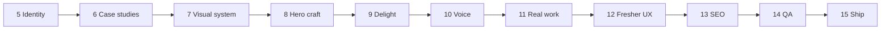

# Roadmap

Phases 1–4 shipped **structure and integration**. Phases 5–9 shipped **demo content, craft, and delight**. Phases 10–15 **rebrand to your real profile** (startup engineer, ~1+ YOE), then **SEO, QA, and ship**.

**Visual theme stays space-themed.** Copy and résumé facts change; starfield, planet, and mission-control metaphor remain.

**Recommended order:** 5 → … → 9 (done) → **10 → 11 → (12 optional) → 13 → 14 → 15**

**Before Phase 10:** complete [content-inventory.md](./content-inventory.md).

---

## Phase 1 — Scaffold (complete)

- Vite + React + TS + Tailwind v4 + shadcn button
- Content schema, hero shell, agent docs/rules/skills

---

## Phase 2 — 2D interactivity (complete)

- `src/features/canvas/` — full-page starfield, pointer repulsion, scroll parallax
- `StarfieldBackground` in `shell/Layout.tsx`; lazy canvas + CSS fallback
- UX refinements: background-only horizontal parallax, shell glass chrome, drift tuning — [ADR 0007](decisions/0007-canvas-interaction-ux.md)
- [ADR 0006](decisions/0006-canvas-performance.md) — performance caps
- Playwright smoke tests (`e2e/home.spec.ts`, `npm run test:e2e`)

**Done when:** build passes; stars + repulsion + reduced-motion fallback verified.

---

## Phase 3 — Portfolio sections (complete)

Features: `about`, `projects`, `experience`, `skills`, `contact`.

- Single-page home with anchor sections; `/projects/:slug` detail routes — [ADR 0008](decisions/0008-portfolio-sections-routing.md)
- Mobile sheet nav; mailto contact form (no backend)
- Playwright: `e2e/home.spec.ts`, `e2e/projects.spec.ts`

**Done when:** all sections visible; detail nav works; mobile sheet; mailto form; build + e2e pass.

---

## Phase 4 — Hybrid 3D (complete)

- Lazy R3F hero accent (planet + orbit ring); single WebGL mount on home
- Home order: Hero → Projects → About → … — proof-of-work early
- CSS fallback for reduced motion — [ADR 0010](decisions/0010-scene3d-performance.md)
- Playwright: `e2e/scene3d.spec.ts`

**Done when:** hero planet visible; starfield unchanged; `three` in separate chunk; typecheck + lint + build + e2e pass.

---

## Phase 5 — Identity & clarity (complete)

**Goal:** Visitors know who you are, what you do, and what you want in under 10 seconds.

- Hero `roleLine`; resume from `meta.resumeUrl` in header + hero
- About avatar, location, `openTo` line; distinct `contact.message`
- Placeholder assets: `public/assets/avatar.png`, `resume.pdf`
- [ADR 0011](decisions/0011-identity-content-presentation.md)

**Note:** Shipped with **demo persona** (Nova Chen / aerospace). Replaced in Phases 10–11.

**Done when:** Recruiter-scannable hero; About humanized; resume links work; copy from `portfolio.json` only; build + e2e pass.

---

## Phase 6 — Project case studies (complete)

**Goal:** Projects prove impact, not just existence.

- Content: problem → role → outcomes with metrics per project
- Schema: `image`, `imageAlt`, `role`, `outcomes[]`, `year`, `domain`, `flagship`
- Thumbnail on every project card; featured + flagship visual treatment
- Detail page: hero image, metrics strip, long-form body, live + repo CTAs
- [ADR 0012](decisions/0012-project-case-studies.md)

**Note:** Demo projects (orbital-telemetry, etc.) replaced in Phase 11.

**Done when:** All projects have images + at least one metric; featured work is obvious; detail pages read as case studies.

---

## Phase 7 — Visual design system (complete)

**Goal:** Site feels designed as one product, not sections bolted together.

- Token/contrast pass; Geist display headings; `FrostedPanel`; section bands (Projects, Experience, Contact)
- About uses `SectionHeading`; shell mobile tap targets; hero above-fold CTA
- [ADR 0013](decisions/0013-visual-design-system.md), [visual-principles.md](visual-principles.md)

**Done when:** Clear polish vs Phase 6; muted text contrast documented; patterns documented; build + e2e pass.

---

## Phase 8 — Hero planet & motion craft (complete)

**Goal:** Hero 3D reads as intentional brand, not a placeholder mesh.

- Layered planet; split rotation; token lights; CSS fallback parity
- [ADR 0010](decisions/0010-scene3d-performance.md) amendment

**Done when:** Planet reads branded; fallback matches; perf caps met; build + e2e pass.

---

## Phase 9 — Delight & theme (complete)

**Goal:** Memorable personality without hurting scanability or load time.

- Mission timeline badges (Launch / Orbit / Dock); mission-control `?` dialog
- [ADR 0014](decisions/0014-phase9-delight.md)

**Done when:** Delight ships; build + e2e pass. **Metaphor kept** through content rebrand (map phases to intern → FT → current).

---

## Phase 10 — Identity & voice (personal rebrand)

**Goal:** Honest hero, about, and meta for a **startup engineer (~1+ YOE)** — space **skin**, startup **story**.

**Prerequisite:** [content-inventory.md](./content-inventory.md) filled in.

**Deliverables**

- Rewrite `meta`, `hero`, `about`, section subtitles, `missionControl` transmissions
- Tone: early-career, intern + full-time startup path — no fake senior/aerospace claims
- Mission phase legend copy: optional friendlier labels (Intern / Full-time / Current) while keeping enum
- De-hardcode e2e from “Nova Chen” / Stellar Dynamics / orbital-telemetry strings → structure + your inventory
- Amend [ADR 0011](decisions/0011-identity-content-presentation.md) (early-career voice guidelines)

**Out of scope:** New projects/experience entries (Phase 11); schema changes (Phase 12)

**Done when:** Hero role line and about match résumé; no credibility gaps vs 1+ YOE; e2e updated.

---

## Phase 11 — Real work portfolio

**Goal:** Replace demo case studies and jobs with **your** startups, projects, and metrics.

**Deliverables**

- New `portfolio.json` projects (2–4) with real slugs, bodies, outcomes, repos/links
- Real experience timeline (dates, titles, companies)
- Replace `public/assets/projects/*`, avatar, resume PDF
- Update project detail e2e for new flagship slug
- Amend [ADR 0012](decisions/0012-project-case-studies.md) (early-career outcome examples)

**Out of scope:** Education section (Phase 12); SEO tags (Phase 13)

**Done when:** Every claim is interview-defensible; flagship project is yours; images or documented placeholders.

---

## Phase 12 — Fresher affordances (optional)

**Goal:** UI/schema affordances recruiters expect at ~0–2 YOE.

**Pick what you need:**

| Option | Description |
|--------|-------------|
| A. `employmentType` | `intern` \| `full-time` \| `contract` on experience entries + badge on timeline |
| B. Education section | Degree/bootcamp in schema + `#education` or About subsection |
| C. Schema relax | Allow 1–2 projects without PNG; optional outcomes for repo-only entries |
| D. Mission phase labels | Content-only rename: Launch → Intern, Orbit → Full-time, Dock → Current |

**Done when:** Chosen items ship; schema + content-schema.md + ADR updated.

---

## Phase 13 — SEO & sharing

**Goal:** Correct previews when the site is linked (Slack, LinkedIn, etc.).

**Deliverables**

- `<title>` and meta description from **your** `portfolio.json` `meta`
- Open Graph + Twitter cards; real OG image (replace placeholder)
- Per-project meta on detail routes
- Semantic landmarks (one H1, logical heading order)
- `robots.txt`, `sitemap.xml`, favicon + apple-touch-icon

**Out of scope:** Analytics, CMS, i18n

**Done when:** Sharing home + one project URL shows correct preview.

---

## Phase 14 — Quality, accessibility & performance

**Goal:** Confidence to show recruiters, a11y advocates, and perf-conscious teams.

**Deliverables**

- Documented Lighthouse run (targets TBD, e.g. Perf ≥90, A11y ≥95 on home)
- Keyboard audit: header, sheet, tabs, form, mission-control, project links
- Reduced-motion coverage for canvas, 3D, delight
- Expanded Playwright (OG smoke, a11y checks, project detail with image)
- Bundle review: `three` still lazy; no regressions

**Done when:** Report in `docs/`; expanded e2e green; known issues listed.

---

## Phase 15 — Ship

**Goal:** Live portfolio on a real URL.

**Deliverables**

- Host choice (Vercel, Netlify, Cloudflare Pages, GitHub Pages, etc.)
- CI: build + test on PR
- Custom domain (optional)
- Deploy checklist in `docs/`
- Production smoke test
- Optional analytics (Plausible/Fathom) — explicit opt-in

**Done when:** Public HTTPS URL; pipeline documented; link-ready for résumé.

---

## Phase dependencies

| Phase | Depends on |
|-------|------------|
| 5–9 | (complete — demo content) |
| 10 | [content-inventory.md](./content-inventory.md) |
| 11 | 10 (voice + inventory) |
| 12 | 11 (optional) |
| 13 | 10–11 + real OG artwork |
| 14 | 7–13 |
| 15 | 14 |

---

## Content rebrand principle

| Keep | Change |
|------|--------|
| Starfield, planet, tokens, frosted UI | `meta`, hero, about, experience, projects |
| Mission-control easter egg, phase badges | Company names, titles, dates, metrics |
| Case-study structure (problem → build → outcome) | Demo aerospace narrative → startup work |
