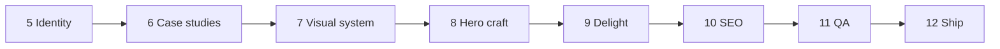

# Roadmap

Phases 1–4 shipped **structure and integration**. Phases 5–12 focus on **content, craft, trust, and ship** — one clear goal per phase.

**Recommended order:** 5 → 6 → 7 → 8 → (9 optional) → 10 → 11 → 12

---

## Phase 1 — Scaffold (complete)

- Vite + React + TS + Tailwind v4 + shadcn button
- Content schema, hero shell, agent docs/rules/skills

---

## Phase 2 — 2D interactivity (complete)

- `src/features/canvas/` — full-page starfield, pointer repulsion, scroll parallax
- `StarfieldBackground` in `shell/Layout.tsx`; lazy canvas + CSS fallback
- UX refinements: background-only horizontal parallax, shell glass chrome, drift tuning — [ADR 0007](decisions/0007-canvas-interaction-ux.md)
- [ADR 0006](decisions/0006-canvas-performance.md) — performance caps
- Playwright smoke tests (`e2e/home.spec.ts`, `npm run test:e2e`)

**Done when:** build passes; stars + repulsion + reduced-motion fallback verified.

---

## Phase 3 — Portfolio sections (complete)

Features: `about`, `projects`, `experience`, `skills`, `contact`.

- Single-page home with anchor sections; `/projects/:slug` detail routes — [ADR 0008](decisions/0008-portfolio-sections-routing.md)
- Mobile sheet nav; mailto contact form (no backend)
- Playwright: `e2e/home.spec.ts`, `e2e/projects.spec.ts`

**Done when:** all sections visible; detail nav works; mobile sheet; mailto form; build + e2e pass.

---

## Phase 4 — Hybrid 3D (complete)

- Lazy R3F hero accent (planet + orbit ring); single WebGL mount on home
- Home order: Hero → Projects → About → … — proof-of-work early
- CSS fallback for reduced motion — [ADR 0010](decisions/0010-scene3d-performance.md)
- Playwright: `e2e/scene3d.spec.ts`

**Done when:** hero planet visible; starfield unchanged; `three` in separate chunk; typecheck + lint + build + e2e pass.

---

## Phase 5 — Identity & clarity (complete)

**Goal:** Visitors know who you are, what you do, and what you want in under 10 seconds.

- Hero `roleLine`; resume from `meta.resumeUrl` in header + hero
- About avatar, location, `openTo` line; distinct `contact.message`
- Placeholder assets: `public/assets/avatar.png`, `resume.pdf`
- [ADR 0011](decisions/0011-identity-content-presentation.md)

**Done when:** Recruiter-scannable hero; About humanized; resume links work; copy from `portfolio.json` only; build + e2e pass.

---

## Phase 6 — Project case studies

**Goal:** Projects prove impact, not just existence.

**Deliverables**

- Content: problem → role → **outcomes with metrics** per project
- Schema: optional `image`, `role`, `outcomes[]`, `year`, `domain`
- Thumbnail on every project card; **featured** visual treatment
- Detail page: hero image, metrics strip, long-form body, live + repo CTAs
- One **flagship** case study (richest content + best visual)
- E2E: detail page covers image + outcomes when present

**Out of scope:** Video embeds, interactive demos, per-project WebGL

**Done when:** All projects have images + at least one metric; featured work is obvious; detail pages read as case studies.

---

## Phase 7 — Visual design system

**Goal:** Site feels designed as one product, not sections bolted together.

**Deliverables**

- Token pass: void/nebula depth, accent/orbit balance, glow, muted-text contrast (WCAG-friendly)
- Typography scale; consistent `SectionHeading` usage
- Section rhythm: spacing, optional dividers or subtle band backgrounds
- Unified frosted cards (projects + experience); hover/focus states
- Shell chrome tuned vs starfield; mobile tap targets and hero CTA above fold
- Short visual principles doc in `docs/`

**Out of scope:** Planet shaders, new sections, SEO

**Done when:** Clear polish vs Phase 4; contrast check on muted text; patterns documented.

---

## Phase 8 — Hero planet & motion craft

**Goal:** Hero 3D reads as intentional brand, not a placeholder mesh.

**Deliverables**

- Planet: layered materials, atmosphere hint, rim light; ring vs planet motion
- `Scene3DFallback` matches new planet look (reduced motion)
- Lighting aligned with Phase 7 tokens
- Optional subtle bloom only if perf OK — amend [ADR 0010](decisions/0010-scene3d-performance.md) if needed

**Out of scope:** OrbitControls, clickable 3D, GLTF assets, heavy postprocessing

**Done when:** Planet no longer reads “default demo”; fallback matches; perf caps still met.

---

## Phase 9 — Delight & theme (optional)

**Goal:** Memorable personality without hurting scanability or load time.

**Pick 1–2:**

| Option | Description |
|--------|-------------|
| A. Constellation hotspots | Star tooltips for skills/facts (defer from Phase 2b) |
| B. Mission timeline | Experience as missions (Launch → Orbit → Dock) |
| C. Easter egg | e.g. `?` opens mission-control help panel |
| D. Testimonial | One quote in About or after Projects |
| E. Transmission log | 2–3 links to writing or talks |

**Out of scope:** Blog CMS, chat widget, heavy gamification

**Done when:** Chosen items ship with reduced-motion fallbacks.

---

## Phase 10 — SEO & sharing

**Goal:** Correct previews when the site is linked (Slack, LinkedIn, etc.).

**Deliverables**

- `<title>` and meta description from `portfolio.json` `meta`
- Open Graph + Twitter cards; real OG image (replace placeholder)
- Per-project meta on detail routes
- Semantic landmarks (one H1, logical heading order)
- `robots.txt`, `sitemap.xml`, favicon + apple-touch-icon

**Out of scope:** Analytics, CMS, i18n

**Done when:** Sharing home + one project URL shows correct preview.

---

## Phase 11 — Quality, accessibility & performance

**Goal:** Confidence to show recruiters, a11y advocates, and perf-conscious teams.

**Deliverables**

- Documented Lighthouse run (targets TBD, e.g. Perf ≥90, A11y ≥95 on home)
- Keyboard audit: header, sheet, tabs, form, project links; visible focus
- Reduced-motion coverage for canvas, 3D, and any Phase 9 delight
- Expanded Playwright (OG smoke, a11y checks, project detail with image)
- Bundle review: `three` still lazy; no regressions

**Done when:** Report in `docs/`; expanded e2e green; known issues listed.

---

## Phase 12 — Ship

**Goal:** Live portfolio on a real URL.

**Deliverables**

- Host choice (Vercel, Netlify, Cloudflare Pages, GitHub Pages, etc.)
- CI: build + test on PR
- Custom domain (optional)
- Deploy checklist in `docs/`
- Production smoke test
- Optional analytics (Plausible/Fathom) — explicit opt-in

**Done when:** Public HTTPS URL; pipeline documented; link-ready for résumé.

---

## Phase dependencies

| Phase | Depends on |
|-------|------------|
| 5 | — |
| 6 | 5 (copy tone) |
| 7 | 5–6 (content mostly stable) |
| 8 | 7 (tokens) |
| 9 | 7–8 (optional) |
| 10 | 5–6 + real OG artwork |
| 11 | 7–10 |
| 12 | 11 |
